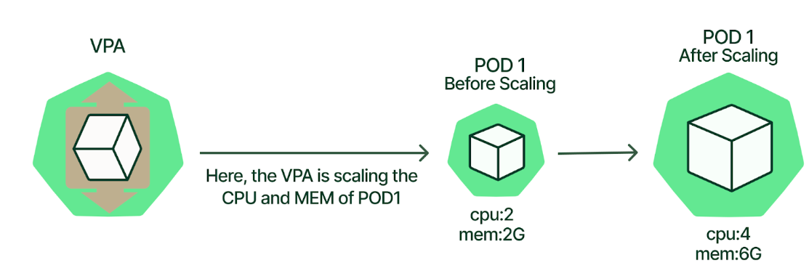

# The Guide To Kubernetes VPA by Example:
Kubernetes Vertical Pod Autoscaler (VPA) is an autoscaler that enables automatic CPU and memory request and limit adjustments based on historical resource usage measurements. When used correctly, it can help you efficiently and automatically allocate the resources of a Kubernetes cluster—at the container level.
This article will present the different types of resource configurations that can be set on each container of a pod , then it will explain how to use vpa to automatically allocate the resources of a Kubernetes (in this case, i will use an AKS cluster "Azure Kuberentes Service").

## Requests and Limits in Kubernetes :
There are two different types of resource configurations that can be set on each container of
a pod , They are requests and limits.

**Requests** :define the minimum amount of resources that containers need  ,If you think that your app requires at least 256MB of memory to operate, this is the request value.
	The scheduler reads the requests for each container in your Pods, aggregates them and finds the best node that can fit that Pod. Kubernetes checks the requests and finds the best Node for that Pod.

**limits** : define the max amount of resources that the container can consume ,Your application might require at least 256MB of memory, but you might want to be sure that it doesn't consume more than 1GB of memory.
	Setting limits is useful to stop over-committing resources and protect other deployments from resource starvation.
 When the application uses more than the limit of memory, Kubernetes kills the process with an OOMKilling (Out of Memory Killing) message.
[](doc-image/limit%26Request-K8S.PNG)

## A plan for finding the right requests and limits
Requests and limits depend on how much memory and CPU the application uses.Those values are also affected by how the application is used.
### General Proposition :
•	An application that serves static pages might have a memory and CPU mostly static.
•	An application that stores documents in the database might behave differently as more traffic is ingested.
### Use of VPA : Vertical Pod Autoscaler
- Kubernetes Vertical Pod Autoscaler (VPA) is a component you install in your cluster. It increases and decreases container CPU and memory resource configuration to align cluster resource allotment with actual usage.
[](doc-image/vpa.PNG)

-	When configured, it will set the requests automatically based on usage and thus allow proper scheduling onto nodes so that appropriate resource amount is available for each pod. It will also maintain ratios between limits and requests that were specified in initial containers configuration.
- Fundamentally, the difference between VPA and HPA lies in how they scale. HPA scales by adding or removing pods—thus scaling capacity horizontally. VPA, however, scales by increasing or decreasing CPU and memory resources within the existing pod containers—thus scaling capacity vertically.

**Installation and configuration on AKS cluster** :
- Assumption And Prerequisites :
. `AKS` cluster is running Kubernetes version 1.24 and higher.
. The `Azure CLI` version 2.0.64 or later installed and configured.
. `kubectl` should be connected to the cluster you want to install VPA.
- Configuration :

1- Install and update the aks-preview Azure CLI extension:
```bash
az extension add --name aks-preview
az extension update --name aks-preview
```
2- Register the 'AKS-VPAPreview' feature flag :
```bash
az feature register --namespace "Microsoft.ContainerService" --name "AKS-VPAPreview"
```
When the status reflects Registered, refresh the registration of the Microsoft.ContainerService resource provider by using the az provider register command:
```bash
az provider register --namespace Microsoft.ContainerService
```
3- Deploy, upgrade, or disable VPA on a cluster :
to enable VPA on an existing cluster, use the --enable-vpa with the az aks upgrade command:
```bash
az aks update -n aks-lab -g Saif-aks-lab --enable-vpa
```
	After a few minutes, the command completes and returns JSON-formatted information about the cluster.
	To verify that the Vertical Pod Autoscaler pods have been created successfully, use :
```bash
kubectl get pods -n kube-system | grep vpa
```
The vpa project consists of 3 components :
•	Recommender - it monitors the current and past resource consumption and, based on it, provides recommended values for the containers' cpu and memory requests.
•	Updater - it checks which of the managed pods have correct resources set and, if not, kills them so that they can be recreated by their controllers with the updated requests.
•	Admission Plugin - it sets the correct resource requests on new pods (either just created or recreated by their controller due to Updater's activity).

**Demo: example of VPA**

With everything configured, let’s take a basic application ,deploy it on the cluster we just built and scale the cluster based on the VPA recommendation.
I will use in this demo , a sample app named 'hamster'
my aks cluster named 'aks-lab' have 3 nodes ,and i use the 1.24.6 kuberntes version for this demo
```bash
root@EB850FSIG-18:VPA-AKS# kubectl get nodes
NAME                                STATUS   ROLES   AGE     VERSION
aks-nodepool1-14294776-vmss000000   Ready    agent   2d18h   v1.24.6
aks-nodepool1-14294776-vmss000001   Ready    agent   2d18h   v1.24.6
aks-nodepool1-14294776-vmss000002   Ready    agent   2d18h   v1.24.6
```
```bash
ls
README.md  doc-image             hamster3-deploy.yaml  vpa-hamster1-autodeploy.yaml  vpa-hamster3-autodeploy.yaml
hamster2-deploy.yaml  hasmter1-deploy.yaml  vpa-hamster2-autodeploy.yaml
```
le's' deploy the 3 hamster app :
```bash
kubectl apply -f hasmter1-deploy.yaml -f hamster2-deploy.yaml  -f hamster3-deploy.yaml
```
and let's check the pods status :
```bash
root@EB850FSIG-18:VPA-AKS# kubectl get po
NAME                        READY   STATUS    RESTARTS   AGE
hamster1-5584cc7969-26qhc   1/1     Running   0          3m17s
hamster1-5584cc7969-wpctj   1/1     Running   0          3m17s
hamster2-684cc564f-m4xvb    1/1     Running   0          2m40s
hamster2-684cc564f-qn4z2    1/1     Running   0          2m40s
hamster3-6c69df5869-98f9n   0/1     Pending   0          2m21s
hamster3-6c69df5869-xdgf6   0/1     Pending   0          2m21s
```
Some of the pods are in a pending status , if we run describe one of this pods :
```bash
root@EB850FSIG-18:VPA-AKS# kubectl describe po  hamster3-6c69df5869-xdgf6
Name:           hamster3-6c69df5869-xdgf6
Namespace:      hamster
.
.
.
Events:
  Type     Reason            Age   From               Message
  ----     ------            ----  ----               -------
  Warning  FailedScheduling  53s   default-scheduler  0/3 nodes are available: 3 Insufficient cpu. preemption: 0/3 nodes are available: 3 No preemption victims found for incoming pod.
```
- if we make a look to one of the deplpyment manifsest file we will find that we have define the below limit and request for each container :
```bash
kubectl describe po hamster-5bccbb88c6-58qmj

   Limits:
      cpu:     1500m
      memory:  900Mi
    Requests:
      cpu:        1
      memory:     500Mi
```
- Bescasue we request 1Cpu and  500Mi memeory for each pods, the scheduler don't find the necessary resource to deploy the pods , in my case i have enabled the cluster autoscaler
So after some moments the cluster create a new nodes for us and our pods are in a running status :
```bash
root@EB850FSIG-18:VPA-AKS# kubectl get nodes
NAME                                STATUS   ROLES   AGE     VERSION
aks-nodepool1-14294776-vmss000000   Ready    agent   2d18h   v1.24.6
aks-nodepool1-14294776-vmss000001   Ready    agent   2d18h   v1.24.6
aks-nodepool1-14294776-vmss000002   Ready    agent   2d18h   v1.24.6
aks-nodepool1-14294776-vmss000003   Ready    agent   98s     v1.24.6
aks-nodepool1-14294776-vmss000004   Ready    agent   60s     v1.24.6
aks-nodepool1-14294776-vmss000005   Ready    agent   76s     v1.24.6
```
```bash
root@EB850FSIG-18:VPA-AKS# kubectl get po
NAME                        READY   STATUS    RESTARTS   AGE
hamster1-5584cc7969-26qhc   1/1     Running   0          5m31s
hamster1-5584cc7969-wpctj   1/1     Running   0          5m31s
hamster2-684cc564f-m4xvb    1/1     Running   0          4m54s
hamster2-684cc564f-qn4z2    1/1     Running   0          4m54s
hamster3-6c69df5869-98f9n   1/1     Running   0          4m35s
hamster3-6c69df5869-xdgf6   1/1     Running   0          4m35s
```
-But if we check the real value of cpu and memory utilization , is really we need this number of nodes to run our pods ?
```bash
root@EB850FSIG-18:VPA-AKS# kubectl resource-capacity --pods --util -n hamster
NODE                                POD                         CPU REQUESTS   CPU LIMITS    CPU UTIL     MEMORY REQUESTS   MEMORY LIMITS   MEMORY UTIL
*                                   *                           6000m (52%)    9000m (78%)   0Mi (0%)     3000Mi (10%)      5400Mi (19%)    0Mi (0%)

aks-nodepool1-14294776-vmss000000   *                           1000m (52%)    1500m (78%)   501m (26%)   500Mi (10%)       900Mi (19%)     2Mi (0%)
aks-nodepool1-14294776-vmss000000   hamster1-5584cc7969-wpctj   1000m (52%)    1500m (78%)   501m (26%)   500Mi (10%)       900Mi (19%)     2Mi (0%)

aks-nodepool1-14294776-vmss000001   *                           1000m (52%)    1500m (78%)   498m (26%)   500Mi (10%)       900Mi (19%)     3Mi (0%)
aks-nodepool1-14294776-vmss000001   hamster2-684cc564f-m4xvb    1000m (52%)    1500m (78%)   498m (26%)   500Mi (10%)       900Mi (19%)     3Mi (0%)

aks-nodepool1-14294776-vmss000002   *                           1000m (52%)    1500m (78%)   500m (26%)   500Mi (10%)       900Mi (19%)     2Mi (0%)
aks-nodepool1-14294776-vmss000002   hamster1-5584cc7969-26qhc   1000m (52%)    1500m (78%)   500m (26%)   500Mi (10%)       900Mi (19%)     2Mi (0%)

aks-nodepool1-14294776-vmss000003   *                           1000m (52%)    1500m (78%)   502m (26%)   500Mi (10%)       900Mi (19%)     2Mi (0%)
aks-nodepool1-14294776-vmss000003   hamster2-684cc564f-qn4z2    1000m (52%)    1500m (78%)   502m (26%)   500Mi (10%)       900Mi (19%)     2Mi (0%)

aks-nodepool1-14294776-vmss000004   *                           1000m (52%)    1500m (78%)   502m (26%)   500Mi (10%)       900Mi (19%)     2Mi (0%)
aks-nodepool1-14294776-vmss000004   hamster3-6c69df5869-xdgf6   1000m (52%)    1500m (78%)   502m (26%)   500Mi (10%)       900Mi (19%)     2Mi (0%)

aks-nodepool1-14294776-vmss000005   *                           1000m (52%)    1500m (78%)   501m (26%)   500Mi (10%)       900Mi (19%)     2Mi (0%)
aks-nodepool1-14294776-vmss000005   hamster3-6c69df5869-98f9n   1000m (52%)    1500m (78%)   501m (26%)   500Mi (10%)       900Mi (19%)     2Mi (0%)
```
> the Cpu utilization is 501m and we have define a the value of cpu request to 1000m (1cpu) and the limit to 1500m

>The memory utilization is only 2Mi and we have define the value of memory request to 500 Mi and the limit to 900Mi

- We need to adjust this value , so let's deploy the vertical pod autoscaler for this pods and check the vpa recommndation

```bash
kubectl apply -f vpa-hamster3-autodeploy.yaml -f vpa-hamster2-autodeploy.yaml -f vpa-hamster3-autodeploy.yaml
```
Allow the pod to run at least 5 , and run the fllowing command to view the vpa recommandation:
```bash
➜ kubecl get vpa
➜ kubectl describe vpa vpa-auto-h1

Name:         vpa-auto-h1
Namespace:    hamster
Labels:       <none>
Annotations:  <none>
API Version:  autoscaling.k8s.io/v1
Kind:         VerticalPodAutoscaler
...
...
...
Spec:
  Target Ref:
    API Version:  apps/v1
    Kind:         Deployment
    Name:         hamster3
  Update Policy:
    Update Mode:  Auto
Status:
  Conditions:
    Last Transition Time:  2023-02-17T11:12:19Z
    Status:                True
    Type:                  RecommendationProvided
  Recommendation:
    Container Recommendations:
      Container Name:  hamster3
      Lower Bound:
        Cpu:     544m
        Memory:  262144k
      Target:
        Cpu:     587m
        Memory:  262144k
      Uncapped Target:
        Cpu:     587m
        Memory:  262144k
      Upper Bound:
        Cpu:     22811m
        Memory:  446907537
```
Here’s what we can see:

- The lower bound is the minimum estimation for the container.
- The upper bound is the maximum recommended resource estimation for the container.
- Target estimation is the one we will use for setting resource requests.
All of these estimations are capped based on min allowed and max allowed container policies.
- The uncapped target estimation is a target estimation produced if there were no minAllowed and maxAllowed restriction

Check the status of the pods , because we use the vpa with the "Auto" mode  , the VPA will automatically scale the cluster based on the VPA recommendations.the hamster pod gets terminated, and a new pod is provisioned with a new recommancation:
```bash
root@EB850FSIG-18:VPA-AKS# kubectl get po
NAME                        READY   STATUS        RESTARTS   AGE
hamster1-5584cc7969-kfvds   1/1     Running       0          16s
hamster1-5584cc7969-q97bx   1/1     Running       0          76s
hamster1-5584cc7969-wpctj   1/1     Terminating   0          36m
hamster2-684cc564f-2zkvt    1/1     Running       0          76s
hamster2-684cc564f-m4xvb    1/1     Terminating   0          36m
hamster2-684cc564f-skznl    1/1     Running       0          16s
hamster3-6c69df5869-98f9n   1/1     Running       0          36m
hamster3-6c69df5869-xdgf6   1/1     Running       0          36m

```
If we describe one of this pods and focus to the value of request and limits:
```bash
root@EB850FSIG-18:/mnt/c/Users/ssegni/FFF/VPA-AKS# kubectl describe po hamster1-5584cc7969-kfvds
Name:         hamster1-5584cc7969-kfvds
Namespace:    hamster
....
...
...
 Limits:
      cpu:     880m
      memory:  450Mi
    Requests:
      cpu:        587m
      memory:     262144k
```
Now let's come back and compare the value of cpu and memory utlization with this recommandtions values:
```bash
 kubectl resource-capacity --pods --util -n hamster
NODE                                POD                         CPU REQUESTS   CPU LIMITS    CPU UTIL     MEMORY REQUESTS       MEMORY LIMITS   MEMORY UTIL
*                                   *                           3522m (30%)    5280m (46%)   0Mi (0%)     1572864000000m (5%)   2700Mi (9%)     0Mi (0%)

aks-nodepool1-14294776-vmss000000   *                           587m (30%)     880m (46%)    457m (24%)   262144000000m (5%)    450Mi (9%)      2Mi (0%)
aks-nodepool1-14294776-vmss000000   hamster3-6c69df5869-h9s9t   587m (30%)     880m (46%)    457m (24%)   262144000000m (5%)    450Mi (9%)      2Mi (0%)

aks-nodepool1-14294776-vmss000001   *                           0Mi (0%)       0Mi (0%)      0Mi (0%)     0Mi (0%)              0Mi (0%)        0Mi (0%)

aks-nodepool1-14294776-vmss000002   *                           1174m (61%)    1760m (92%)   898m (47%)   524288000000m (10%)   900Mi (19%)     3Mi (0%)
aks-nodepool1-14294776-vmss000002   hamster2-684cc564f-skznl    587m (30%)     880m (46%)    449m (23%)   262144000000m (5%)    450Mi (9%)      2Mi (0%)
aks-nodepool1-14294776-vmss000002   hamster3-6c69df5869-7w28v   587m (30%)     880m (46%)    450m (23%)   262144000000m (5%)    450Mi (9%)      2Mi (0%)

aks-nodepool1-14294776-vmss000003   *                           587m (30%)     880m (46%)    457m (24%)   262144000000m (5%)    450Mi (9%)      2Mi (0%)
aks-nodepool1-14294776-vmss000003   hamster1-5584cc7969-kfvds   587m (30%)     880m (46%)    457m (24%)   262144000000m (5%)    450Mi (9%)      2Mi (0%)

aks-nodepool1-14294776-vmss000004   *                           587m (30%)     880m (46%)    457m (24%)   262144000000m (5%)    450Mi (9%)      2Mi (0%)
aks-nodepool1-14294776-vmss000004   hamster1-5584cc7969-q97bx   587m (30%)     880m (46%)    457m (24%)   262144000000m (5%)    450Mi (9%)      2Mi (0%)

aks-nodepool1-14294776-vmss000005   *                           587m (30%)     880m (46%)    457m (24%)   262144000000m (5%)    450Mi (9%)      2Mi (0%)
aks-nodepool1-14294776-vmss000005   hamster2-684cc564f-2zkvt    587m (30%)     880m (46%)    457m (24%)   262144000000m (5%)    450Mi (9%)      2Mi (0%)
```
> Like we have here , the vpa adjust automaticaly CPU and memory request and limit adjustments based on historical resource usage measurements.

And finaly let's check our nodes :
```bash
root@EB850FSIG-18:VPA-AKS# kubectl get nodes
NAME                                STATUS   ROLES   AGE     VERSION
aks-nodepool1-14294776-vmss000000   Ready    agent   2d19h   v1.24.6
aks-nodepool1-14294776-vmss000001   Ready    agent   2d19h   v1.24.6
aks-nodepool1-14294776-vmss000002   Ready    agent   2d19h   v1.24.6
aks-nodepool1-14294776-vmss000004   Ready    agent   51m     v1.24.6
```
> Based on the new values of request and limits , the k8s sechduler find more resource and replainfied some of the pods in other nodes , and the cluster autoscale decreese the nodes number from 6 nodes to 4 nodes.
## Limitations of Kubernetes VPA
- Do not use Vertical Pod Autoscaler with the Horizontal Pod Autoscaler, which scales based on the same resource metrics such as CPU and MEMORY usage. This is because when a metric (CPU/MEMORY) reaches its defined threshold, the scaling event will happen for both VPA and HPA at the same time, which may have unknown side effects and may lead to issues.
- VPA might recommend more resources than available in the cluster, thus causing the pod to not be assigned to a node (due to insufficient resources) and therefore never run. To overcome this limitation, it’s a good idea to set the LimitRange to the maximum available resources. This will ensure that pods do not ask for more resources than the LimitRange defines.
